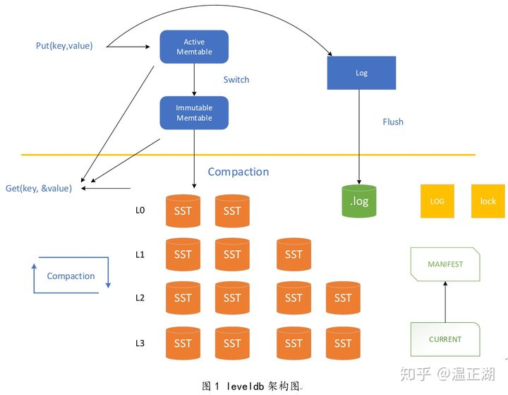

# LevelDB
 **it's a fast key-value storage library written at Google that provides an ordered mapping from string keys to string values.**

>收藏此代码的目的就是为了后面边学习边修改
### 1. OverView


### 2. 从小例子入手
```c++
int main(int argc, char** argv){
    DB* db;
    //这里的Options 调用其默认构造函数
    //Options::Options() : comparator(BytewiseComparator()), env(Env::Default()) {}
    //Env* Env::Default() {
    //  static PosixDefaultEnv env_container;
    //  return env_container.env();
    //}
    Options option;
    option.create_if_missing = true;
    Status status = DB::Open(option,"/home/z/CWorkspace/leveldb/Test/testdb", &db);
    assert(status.ok());

    std::string k1 = "name";
    std::string v1 = "jim";

    status = db->Put(leveldb::WriteOptions(), k1, v1);
    assert(status.ok());

    status = db->Get(leveldb::ReadOptions(), k1, &v1);
    assert(status.ok());
    std::cout<<"k1:"<<k1<<"; v1:"<<v1<<std::endl;
    
    delete db;
}
```
   简单的代码就能将程序运行起来, 根据这些代码能开始阅读源码